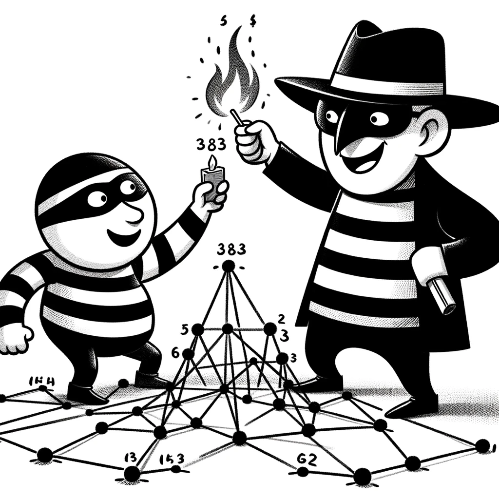

# Minimax in Cops and Robbers: Damage Number



## Overview
The Cops and Robbers game is a two-player, zero-sum game played on a graph. In the original version, the cop moves along edges of the graph to try to capture the robber while the robber tries to evade the cop indefinitely. In the damage number variant, when the robber moves to a new vertex and isn't captured in the following round, the previous vertex they were on becomes damaged.

In this variant, the objective of the cop is to minimize the number of damaged vertices, while the robber aims to maximize it. The damage number of a graph `G`, denoted `dmg(G)` is the minimum number of vertices damaged over all games played on `G` where the robber plays optimally.

This implementation uses a minimax algorithm with alpha-beta pruning to calculate the damage number of any given graph. A few dozen tests cases are provided that demonstrate the functional correctness of the algorithm, for a varity of graph families, such as paths, trees, cycles, and more.

## Prerequisites

Ensure you have Python installed on your system.

You will also need the `networkx` library. You can install it using pip:

```bash
pip install networkx
```

## Usage

To run the program, run `main.py` with the following arguments:

Arguments:

* `--edges`: A list of edges for the graph in the form of a string. Example: "[(0, 1), (0, 2), (1, 2)]""
* `--cop`: The initial position of the cop as an integer.
* `--robber`: The initial position of the robber as an integer.

For example, to determine the number of vertices the robber can damage on `P_6` when the cop starts on a leaf vertex and the robber starts distance two away:

```bash
python main.py --edges="[(0, 1), (1, 2), (2, 3), (3, 4), (4, 5)]" --cop=0 --robber=2
```

## License

Distributed under the MIT license. See [LICENSE](LICENSE) for more information.
