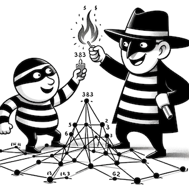

# Minimax in Cops and Robbers: Damage Number

## Overview
The Cops and Robbers game is a two-player, zero-sum game played on a graph. In the original version, the cop moves along edges of the graph to try to capture the robber while the robber tries to evade the cop indefinitely. In the damage number variant, when the robber ends their turn, the vertex they are on becomes damaged. In this variant, the objective of the cop is to minimize the number of damaged vertices, while the robber aims to maximize it.

This implementation uses a minimax algorithm to calculate the number of vertices the robber can damage, given optimal play from both players.

## License

Distributed under the MIT license. See [LICENSE](LICENSE) for more information.
